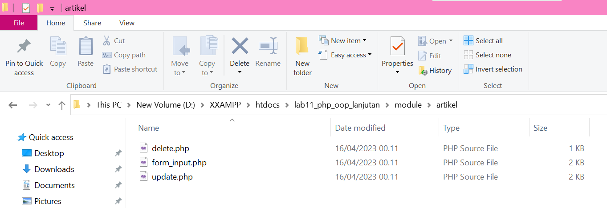
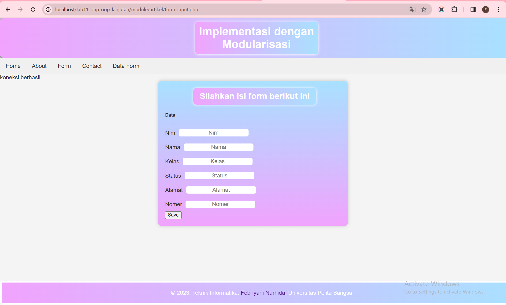

Nama : Febriyani Nurhida

Kelas : TI.22.A.2

Nim : 312210222

Mata Kuliah : Pemrograman Web 1

<h2> Praktikum 11 OOP Lanjutan </h2>

• Buat project baru dengan struktur sebagai berikut:


• Copy file library (class) dari praktikum 10 dan letakkan pada folder
class.


• Buat file template yang berisi template dan css untuk header, footer
dan menu sidebar.


• Buat modul artikel yang berisi CRUD dengan memanfaatkan library
database dan form tersbut.




• File index.php berisi proses routing aplikasi dan dikombinasikan dengan penggunaan mod_rewrite pada file .htaccess

```
<?php
require_once("class/database.php");
require_once("class/form.php");
require_once("template/header.php");

$mod = $_REQUEST['mod'];
switch ($mod) {
  case "mobil":
    require("module/mobil.php");
    break;
  case "data":
    require("data.php");
    break;
  case "about":
    require("about.php");
    break;
  case "contact":
    require("contact.php");
    break;
  case "form_input":
    require("form_input.php");
    break;
  case "data":
    require("data.php");
    break;
  case "update":
    require("update.php");
    break;
  default;
    require("module/mobil.php");

    require_once("template/footer.php");
}
```


### output :

1. Tampilan Home Sidebar


2. Tampilan About Sidebar


3. Tampilan Form Sidebar



4. Tampilan Contact Sidebar


5. Tampilan Data Form Sidebar


6. Tampilan Update Sidebar


<h3> Sekian dan Terima Kasih, Selamat Menempuh UAS</h3>
